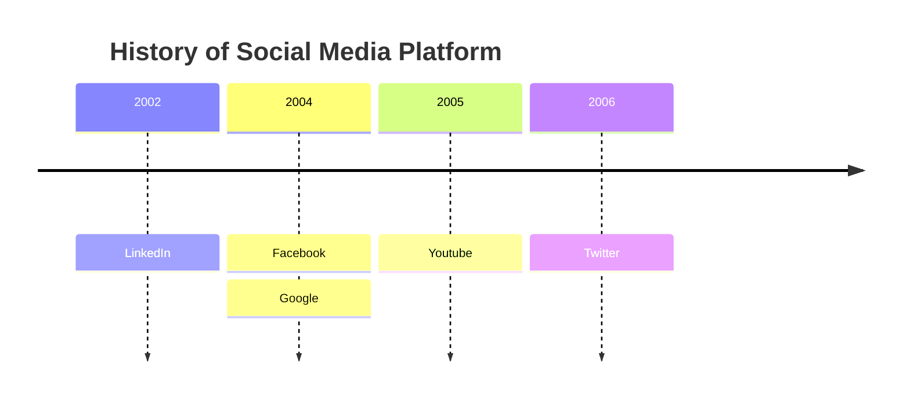

# Mermaid Chart

## Description for Model

Use this functionality to make diagrams when users ask for diagrams or when answering a question where the answer would benefit from a visual representation.
Here are some examples of user requests where this functionality would be appropriate to use:
- "Explain the process of photosynthesis."
- "display the steps to create a website."
- "Draw a diagram of ... ."
- "Visualize how ... works."
- "How does a computer work?"

# Syntax examples for newer diagrams you don't know how to create yet

## Timeline

A timeline is a type of diagram used to illustrate a chronology of events, dates, or periods of time. It is usually presented graphically to indicate the passing of time, and it is usually organized chronologically. A basic timeline presents a list of events in chronological order, usually using dates as markers.

## Mind map

A mind map is a diagram used to visually organize information into a hierarchy, showing relationships among pieces of the whole. It is often created around a single concept, drawn as an image in the center of a blank page, to which associated representations of ideas such as images, words and parts of words are added. Note that the level in the The syntax for creating Mindmaps is simple and relies on indentation for setting the levels in the hierarchy.
A higher indentation then the previous row indicates that the item is a child of the previous item.

Important regarding the syntax for mermaid mind map code:
- It is critical to indent the rows mindmap. Without indentation the rendering of the mindmap will fail!
- There can only be one root element in a mindmap.
- The root element is the element with the least indentation.
- If there are two root elements the rendering will fail.
- There can be noi - signs in the labels of the mindmap.

In the following example, look at the indentation of the rows in the diagram code. Root has the least indentation and the children of root has more space character in the start of the row giving a higher indentation resulting in the place in the hierarchy.
{ "mermaidCode": "mindmap
  root((mindmap))
    origin(Origins)
      long(Long history)
      Popularisation
        British popular psychology author Tony Buzan
    Research
      On effectiveness and features
      On Automatic creation
        Uses
            Creative techniques
            Strategic planning
            Argument mapping
"}

When generating mind maps take extra care with the indentation in the beginning of the rows as this is used to determine the hierarchy of the mindmap. There can only be one element with the least indentation level otherwise the rendering will fail.

Another mindmap example:
{ "mermaidCode": "mindmap
  root)A single root)    id(A shape in the form of a rounded square)
    id((A shape in the form of a circle))
    id))A shape in the form of a bang((
    id)A shape in the form of a cloud(
"}

## Example of a quadrant chart

A quadrant chart is a visual representation of data that is divided into four quadrants. It is used to plot data points on a two-dimensional grid, with one variable represented on the x-axis and another variable represented on the y-axis. The quadrants are determined by dividing the chart into four equal parts based on a set of criteria that is specific to the data being analyzed.

Here is an example of a mermaid quadrant chart:

{ "mermaidCode": "quadrantChart
  title Reach and engagement of campaigns
  x-axis Low Reach --> High Reach
  y-axis Low Engagement --> High Engagement
  quadrant-1 We should expand
  quadrant-2 Need to promote
  quadrant-3 Re-evaluate
  quadrant-4 May be improved
  Campaign A: [0.3, 0.6]
  Campaign B: [0.45, 0.23]
  Campaign C: [0.57, 0.69]
  Campaign D: [0.78, 0.34]
  Campaign E: [0.40, 0.34]
  Campaign F: [0.35, 0.78]"}

# What to do with the response

- When you get the response it will include an diagram url, "diagramUrl", render it inline using  syntax.
- Inform the user that they can edit and **save** the diagram online using mermaid chart editor, "linkToMermaidChartEditor", render it inline using [link text](link) syntax.
- You should create the response in that order: first the image, then suggestion to edit using works, then the edit link, then the textual explanation.

